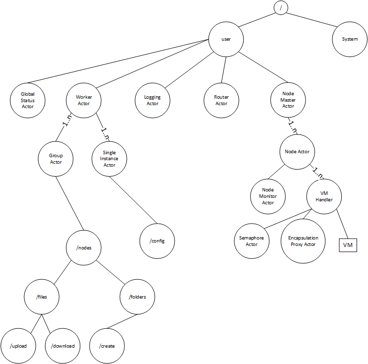

# Testing Cluster
## Start / Arguments
Cluster 0.1 alpha
Usage: Cluster \[master|client\] \[options\]

  --debug                  Start in debug mode
  --verbose                Verbose mode
  --help                   prints this usage text
Command: master \[options\]
run as master
  -i, --input \<task jar\>   jar file that contains the tasks
Command: client \[options\]
run as cluster client
  -s, --seed-node \<seed-node-ip:seed-node-port\>
                           manually choose seed node ip
  --without-vm             client should not provide VMs
  --without-executor       client should not provide Executors

Beispiel:
  * MASTER: master -i TestJar.jar
  * CLIENT: client -s 192.168.178.1:2550

Beim Start muss ein Netzwerkinterface aus einer Liste ausgewählt werden - anschließend wird IP+PORT der Seednode angezeigt - diese beim client als Startparameter mit angeben

## Ziel
* Scala / Akka basiertes Framework für clustering / remoting / parallelism
* Ausführen von in Java / Scala geschriebenen Einheiten / Tasks
* Gruppierung / Single Instance / Depedency-Management
* Failsafe
* Scaling up / out (Automatisches Starten / Stoppen von VMs; Automatisches Deployment)
* Loadbalancing
* System Monitoring (Check welche Komponenten installiert sind (VirtualBox/Vagrant) - abhängig davon Anpassung der Aufgabenvergabe)

## Wie verbindung Java Task <-> Cluster?
* Annotationen @Clustering(Group="/nodes", SingleInstance=False, ...)

## Fehler
1. Cluster Error (z.B. "Node unreachable")
  * Liste von Tasks / ausstehenden Ergebnissen im Master mitführen (not running, pending, done, error)
2. Task Fehler
  * rerun?
  * logging + done?
  * one-for-one / all-for-one supervision strategy
3. VM Fehler / "System" Fehler
  * all-for-one

## ActorHierarchy

## Loadbalancing / "Pull" via GetTask (The Happy Path)
.png)
