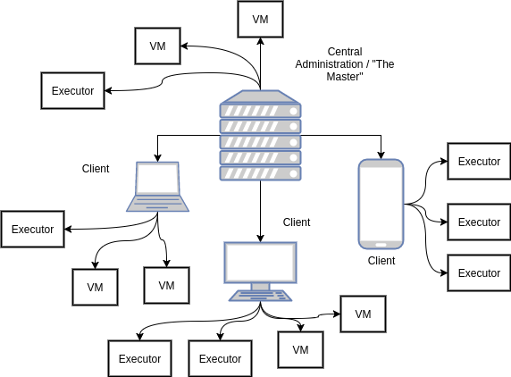

# Testing Cluster
### WHAT IS THIS?
We are proud to present our *Scala-Java-based Testing Cluster* to you!
The basic idea is to run test agains multiple instances of an to-be-tested application.
The instances of the application are run in virtual machines, since virtual machines make provisioning and reconfiguring very easy - and they also provide the ability to run anything you want (Linux, Windows, OSX, iOS, Android, ...) on anything you want (Linux, Windows, OSX, even your smartphone (Jup, Scala can be run on a smartphone)).

The cluster can be seen as three different parts that work together:

###### 1. Central Administration / "The Master"
This part is responsible for providing the tasks, collecting / persisting the results, keeping track of all other parts, responding to failures / failure recovery and is the main entry point for all other parts.

###### 2. Executors
This part is responsible for the actual execution of the tasks.

###### 3. Virtual Machines
This part is responsible for the hosting of the to-be-tested application. It also keeps track of its own workload and asks the Central Administration for new tasks (task "pulling").

There is only one instance of the Central Administration, but there can be multiple instances of Executors and Virtual Machines.
Usually there is at least one Virtual Machine (+ some Executors) located on the same physical node as the Central Administration, which means that the cluster can be run on a single physical node.
If you add more physical nodes to the cluster, than those nodes will host Virtual Machines and Executors on them, which will increase the amount of tasks that are being run in parallel.

*The more physical nodes - the faster the execution of all tasks*



### HOW DOES IT WORK?
The Cluster is based on the [Akka Framework](http://akka.io). Akka is one implementation of the [Actor Model](https://en.wikipedia.org/wiki/Actor_model) - a model of concurrent computation that treats small, independent units (so called "actors") as the universal primitives. Those actors depend on each other (every actor has a parent actor that supervises it), which is why we used this model for our implementation since it is very resilient and "self healing". We keep the "core" on the Central Administration and everything else can be outsourced to other nodes - if one of those nodes looses its connection to the cluster than the "parent" recognizes that and can react accordingly.

### HOW CAN I USE IT?
Check our documentation!

### CAN I DO OTHER THINGS APART FROM TESTING WITH THIS THING?
Theoretically yes, but our main goal was to provide a testing cluster. If you read through the documentation you will get an idea about how this thing works ;)

### ENOUGH OF THE THEORETICAL STUFF - I WANT TO SEE SOME ACTION!!!
It seems as if you are one of the unpatient guys... you want action? You get action!

1) Install / Complile the cluster (described [here](../wikis/basics/1-prerequisites-and-installation)
2) Navigate to ```PROJECT_ROOT/TestJar``` and run the ```create_test_jar.sh``` script - now you have a ```PROJECT_ROOT/TestJar/TestJar.jar``` file
3) Run ```java -jar PROJECT_ROOT/target/scala-*.*/Clustering.jar master -i PROJECT_ROOT/TestJar/TestJar.jar --debug``` and feel the magic...

You now can check your hypervisor - eventually more and more VMs will be started.

If you check the API (http://IP_OF_YOUR_CLUSTER/api) you can see the actor hierarchy (/tree) and a report of the tasks (/reporting).


### DOCUMENTATION:
* [Wiki](/../wikis/pages)
* [FAQ](/../wikis/faq)
* [ScalaDoc / JavaDoc](/../wikis/dev/how-to-generate-documentation)
